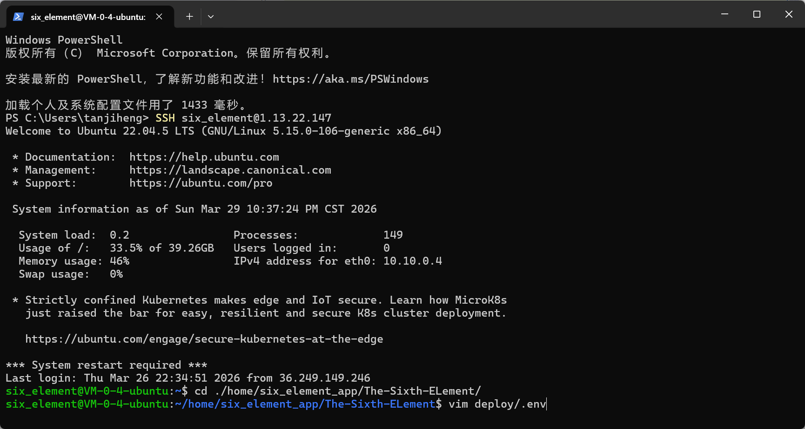
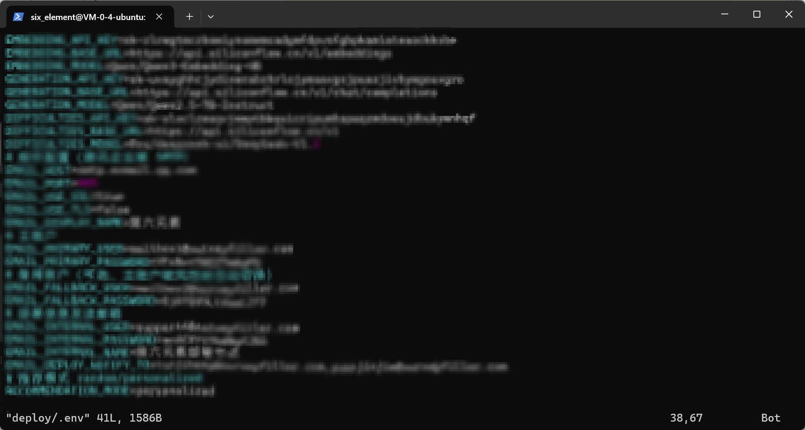

# 服务器 `.env` 更新指南

> 适用场景：团队成员通过 SSH 登录服务器后，使用 `vim` 直接修改部署目录中的 `deploy/.env` 文件。
>
> 目标：在不破坏部署脚本读取逻辑的前提下，安全更新服务器环境变量，并尽量降低误操作风险。

## 1. 更新前先确认

在开始修改之前，请先确认以下事项：

- 你已经登录到正确的服务器。
- 你正在操作的是项目部署目录下的 `deploy/.env`，不是本地开发环境的 `.env`。
- 你已经知道本次要修改的键值对。
- 如果不确定某个值是否应该修改，先和负责人确认，再保存。



## 2. 定位并备份 `.env` 文件

进入项目根目录后，`.env` 文件位于：

```bash
deploy/.env
```

推荐先查看文件内容，确认当前配置：

```bash
cd /home/six_element/home/six_element_app/The-Sixth-ELement
vim deploy/.env
```

如果只是查看，不要直接保存退出。

可以先按 `Esc`，输入 `:q!` 强制退出，避免误修改。

虽然更新部署时，会自动备份，但仍然建议在修改前先做一次手动备份，为了方便可以截图，但注意不要暴露敏感信息。


## 3. 修改内容

直接在 `vim` 中按需修改对应键值对即可。为了避免暴露不必要的隐私信息，这里不再截图 `vim` 内部编辑过程。

编辑时只需要记住以下规则：

- 每一行都保持为 `KEY=value` 形式。
- 不要在键名前面加空格。
- 尽量不要在等号两边加空格。
- 如果脚本依赖某个变量，请不要删除这一行，只修改值。
- 不确定的内容先注释掉前请先确认，因为当前部署脚本是按固定键名读取的。
- 没见过的字段或者不确认请不要动，先和负责人确认。

当前部署脚本会读取的关键项进入时可以看到，里面完全没有没被使用的字段，请根据注释说明修改对应值，新增字段也请写注释。


## 4. 保存并退出 vim

修改完成后，执行以下步骤:

```text
按 Esc
输入 :wq
回车
```

如果你想放弃修改：

```text
按 Esc
输入 :q!
回车
```

## 5. 保存后检查文件内容

退出 `vim` 后，建议立刻再次检查文件内容，避免值写错或行被误删。

```bash
cat deploy/.env
```

也可以只查看关键项：

```bash
grep -E '^(DB_ROOT_PASSWORD|DB_NAME|DB_USER|DB_PASSWORD|EMAIL_HOST|EMAIL_PORT|EMAIL_INTERNAL_USER|EMAIL_INTERNAL_PASSWORD|EMAIL_INTERNAL_NAME|EMAIL_DEPLOY_NOTIFY_TO)=' deploy/.env
```

### 检查要点

- 是否仍然存在所有必需键名。
- 是否有多余空格或拼写错误。
- 是否把换行或特殊字符写坏了。
- 是否误删了其他成员依赖的配置。

## 6. 与部署脚本的关系

服务器上的自动部署脚本会在执行时先备份当前 `deploy/.env`，再继续后续流程。也就是说：

- 你手动改好的 `.env` 会成为之后部署时的最新配置。
- 如果部署失败，脚本会尝试回滚代码，并恢复上一份备份的 `.env`。
- 因此，修改 `.env` 后最好立刻确认内容正确，避免把错误配置带进自动部署。

相关脚本位置：`deploy/update_deploy.sh`

## 7. 推荐操作顺序

```text
1. SSH 登录服务器
2. 进入项目目录
3. 备份 deploy/.env
4. 用 vim 编辑 deploy/.env
5. 保存退出
6. 再次检查内容
7. 如有需要，触发部署或等待自动部署使用新配置
```

注：触发部署方式：1.gitee go的流水线点击执行构建。2. 直接在服务器上执行 deploy/update_deploy.sh 脚本。
命令：

```bash
bash /home/six_element/home/six_element_app/The-Sixth-ELement/deploy/update_deploy.sh
```

## 8. 备注

- 本文档只描述服务器端 `.env` 的手动更新流程。
- 如果后续部署脚本新增了新的环境变量，请同步补充本文档。
- 如果 `.env` 的字段名发生变化，请优先以脚本中的实际读取逻辑为准。
